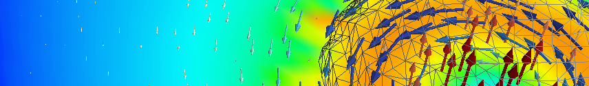

## Introduction
MEEP is a library of functions for numerical simulations of how electromagnetic waves propagate and interact with various structures; it is a finite-difference time-domain solver of the Maxwell equations. The simulation is defined by programming, with bindings to C/C++, Scheme, or Python; I chose to use `python-meep` as Python is a user-friendly language that makes simple simulations (relatively) simple, and really complex ones possible. One can also seamlessly integrate them with powerful Python modules as *numpy*, *scipy*, *matplotlib* and many others.

After I set up several different realistic simulations with *python-meep*, I noticed that much of the Python code for initialisation, material definition, processing and data output can be shared. I therefore moved such code in the *meep_utils.py* and *meep_materials.py* modules. 

To demonstrate how to use them to simplify the simulation setup, I accompany these modules with several ready-to-use simulations of various typical problems.  I believe the presented scripts can be a great starting point for anybody doing their research on photonic crystals, metamaterials, integrated photonics and nanophotonics, cavity resonators, waveguides, etc. 

You are encouraged to clone this repository and to modify the examples to match your needs. I would be very happy if this project helps you with your thesis, homework or any publication. Do not hesitate to contact me if you need some advice, new functionality or if you find a bug.

Filip Dominec, filip.dominec@gmail.com,
2012 - 2016

## Examples using the simulation scripts
Usually, everything you need to run an example is to change to its directory, and launch `./batch.sh`. In a multiprocessing environment, it is recommended to launch it like `export NP=4; ./batch.sh`. 

#### example_metamaterial_s_parameters
Uses `scatter.py` and `effparam.py` to retrieve the effective behaviour of a metamaterial using the Nichols-Ross-Weir (s-parameters) method. Some of these examples are scans through a parameter of the structure.

#### example_frequency_domain_solver 
Runs `scatter.py` multiple times in frequency-domain, and then compares the results to the classical Fourier-transformed time-domain simulation

#### example_current_driven_homogenisation
Using `cdh.py`, `plot_cdh.py`, computes and plots data for current-driven homogenization; compares them with those obtained from s-parameters

#### example_angle_frequency_scan
Sets up both the source and the monitor planes such that they have a growing phase in space (done simply by harmonic modulation of the source amplitude). This way, an oblique wave is excited and recorded. Using arccosine, the angle can be computed from our knowledge of the frequency and the transverse component of the wavevector. By several time-domain simulations with different transverse wavevectors, we can efficiently build a 2D map of angle- and frequency-dependent reflectance of a sample. 

#### example_ringdown_cylindrical_cavity
The simulation in `cylindrical_cavity.py` defines a metallic cylindrical cavity, excites the field by a short pulsed source, and analyzes the ringdown to search for all modes. 

Then  the data are processed by `ringdown_analysis.py` and a comparison of Fourier transform, filter-diagonalisation (*harminv*) method and the textbook analytic solution is plotted. 

Optionally, by uncommenting  the bottom half of `example_ringdown_cylindrical_cavity/batch.sh`, the ringdown analysis can be used to search for terahertz resonances in experimental transmission water vapour. Quite a good match is obtained, which means that harminv works as expected.

#### example_surface_plasmons
Uses `plasmons.py`: A small aperture in a thin metal sheet couples incident light to surface plasmons. 

If the film is surrounded by two media with similar index of refraction, circular interference pattern can be observed between the symmetric and antisymmetric plasmon modes.  A different (hyperbolic) interference pattern can be obtained when the plasmons are coupled by two holes.

   * [ ] TODO add support for metal/diel substrate, 
   * [ ] and try to show the sym-asym interference

#### example_aperture_near-field_microscope/ 
   * [x] detection of field behind the aperture, normalized against free reference
   * [ ] anisotropic permittivity of the dielectric sphere

####  `example_dielectric_bars_width_scan/`
   * [ ]	TODO

#### `example_dielectric_slab_oblique_incidence/`
   * [ ]	TODO , c.f. transfer-matrix

#### `example_refraction_on_MM_wedge_2D/` - defines a wedge of a 2-D rod array (studied earlier both as a photonic crystal and a metamaterial), and by the means of spatial Fourier transform, analyzes how a beam is refracted depending on its frequency. Compares the result with the s-parameter retrieval method.
   * [ ]	TODO implement seamless 2-D support

#### `example_nonlinear_Kerr_focusing/` - demonstrates a source with custom spatial shape, which launches a focused Gaussian beam. Different amplitudes are scanned to show how the nonlinear medium changes the beam and eventually allows filament formation.
   * [ ]	TODO implement nonlinearity, test out

#### example_SPDC/ 
   * `spdc.py` - TODO

## Related resources
 * Official website of MEEP: http://ab-initio.mit.edu/wiki/index.php/Meep     
Contains information on the FDTD algorithm and simulations in general, documentation of the MEEP functions. Examples 
are mostly in Scheme. 
   * Since 2014, the MEEP source code is hosted at Github: https://github.com/stevengj/meep
   * Your questions may (or may not) be answered in the MEEP mailing list: meep-discuss@ab-initio.mit.edu,      
http://www.mail-archive.com/meep-discuss@ab-initio.mit.edu/

 * Website of the python-meep interface: https://launchpad.net/python-meep     
Provides some examples of how the python-meep functions can be used in scripts.

 * I also write my own website on simulations: http://f.dominec.eu/meep/index.html     
Contains my experience with installation requirements and procedure, simulation performance, realistic definition of 
materials, data postprocessing etc.

 * License: GPLv2, http://www.gnu.org/licenses/gpl-2.0.html

## Technical notes
#### Installation procedure 
The scripts require working python-meep environment, recommended compilation procedure is supplied in the `python-meep-install.py` script which is hosted here: https://github.com/FilipDominec/python-meep-install

Some scripts use the matplotlib's binding for LaTeX for nicer plots. You may either install the dependencies using 
`sudo apt-get install -y texlive-latex-extra dvipng`, or modify the scripts to avoid using the latter.

The procedure is tested on Debian-based Linux distributions. You may have to manually modify it if your system differs. Please read the script for details.

#### General modules and other files

 * `meep_utils.py`       - the main module with routines useful for python-meep simulations
 * `meep_materials.py`   - module containing realistic definition of materials used 
 * `README.md`		 - this file
 * `LICENSE`		 - General Public License
 * `metamaterial_models.py` - different metamaterial models (that can be shared by other scripts)
 * `plot_scan_as_contours.py` - if multiple simulations are run as a parametric scan, this allows to present all results in a single contour plot
 * `harminv_wrapper.py` - allows to simply use filter diagonalisation method from Python 

## Troubleshooting - what may happen and what it means
#### Outright errors
 * `terminate called after throwing an instance of 'Swig::DirectorMethodException'`, and simulation fails with an ugly call trace 
   * Perhaps you left some run-time error in the structure definition. Calling `meep_utils.testmaterials()` at the end of the model's initialization may trigger the error first, and help to obtain a reasonable Python report to find the problem.
   * Make sure  to never set a `eps` variable within the `AbstractMeepModel` class, since it is reserved for MEEP callback.
   * If `meep_utils.testmaterials()` did not help, some other error happens within some callback routine. 
 * Simulation hard-crashes during model initialization with the 'memory not mapped' error  (observed with Matplotlib 1.5.1 on Ubuntu 16.10)
   * This happens at the point when matplotlib tries to plot the permittivity spectrum, and to place a label at some high-frequency position like 10^16
   * I reported this error here https://github.com/matplotlib/matplotlib/issues/6984; the solution is in installing a newer fixed version of matplotlib. I suggest picking the freshest one from git: http://matplotlib.org/faq/installing_faq.html#source-install-from-git
   * One little annoyance is that uninstalling the original `python-matplotlib` package one also has to uninstall `paraview`. Compile the new version, then install `paraview` back and everything will be fine.
 * Simulation aborts with `lorentzian unstable` although the medium passed the `meep_utils.testmaterials()` function 
   * The compiled-in check for Lorentzian stability is overly prudent; it sometimes aborts a simulation that would be completely stable. You may either change the material model as MEEP suggests. 
   * I consider this to be just an unfixed bug, see also the discussion https://github.com/stevengj/meep/issues/12. So even better is to change the MEEP source code to bypass the `abort` in function `lorentzian_unstable` in `src/susceptibility.cpp` and recompile it. My branch of MEEP does it.
 * Time-domain simulations abort when I try to define a material with a negative permittivity 
   * The static part of permittivity in the time-domain solver can not be negative. In fact its minimum value is determined by the Courant factor; see https://github.com/stevengj/meep/issues/12. Resort to the frequency-domain solver, or define a proper Drude-Lorentz model.
 * The frequency-domain simulation does not converge when I try to define a material with a negative permittivity 
   * The frequency-domain usually fails to converge in the infrared or optical range. Try to reformulate your problem as a time-domain simulation with a narrow-band source.
   * Try changing the resolution or using other materials. Try running few time-domain steps before running frequency-domain solver. 
 * `AttributeError: 'unicode' object has no attribute 'shrink'`
   * Try disabling LaTeX in Matplotlib.
 * `HDF5-DIAG: Error detected in HDF5` (...) `unable to open file`:w
   * perhaps you try to export the fields twice to the same file?
 * `ValueError: width and height must each be below 32768`
   * this seems like a bug in certain versions of Matplotlib, try disabling labels

#### Invalid or weird results
 * Exported figures show no fields and are black 
   * Infinite values or not-a-numbers resulted from the simulation. This is perhaps due to simulation being unstable (see `amplitudes_time_domain.png`, if available, whether the fields are exponentially decaying or growing.
 * The simulation seems to be stable, but no valid data are plotted 
   * Did you use the same polarisation (field-component) of the source and detectors, etc.? Did you use correct order of magnitude for the source duration and simulation?
 * The retrieved transmission or reflection is over unity 
   * This may be due to spectral leakage from a high-quality resonances, try prolonging the simulation time or using a lossy medium.
   * Make sure to check the time-domain exported fields if they decay in exponential manner, or do something unexpected.
 * Frequency-domain and time-domain results are different 
   * Either the frequency-domain solver did not converge correctly, or the time-domain solver had to modify the material definition to make the simulation stable. In either case, read the simulation printouts what happened.

#### Confusing printouts
 * Tracebacks are double printed, and their lines are randomly mixed.
   * Run the simulation in single process if you need clear debugging messages.
 * Simulation gives correct results, but at the end complaints that `mpirun has exited ... without calling "finalize"` 
   * This is harmless. I did not find any way to prevent the message in python-meep.
 * Simulation writes about 'epsilon averaging' although I did not explicitly enable it. 
   * This appears to be a little bug of python-meep; no matter what it writes, the averaging is probably off anyway

## TODO
- [x] scatter.py, cdh and others should output sim_param in the header (moreover CDH has weird header!!)
- [x] move Kx, Ky out of the model parameters
- [x] put the models into separate module
- [x] sync harminv from its module with meep_utils, and remove from the latter
- [ ] effparam.py does not cope with "plot_freq_max=None" anymore? -- fix
- [x] why I do not see interference of sym/asym plasmons in the example? wrong metal model!
- [x] plot_contour to read any column from direct sim output / effparam
- [ ] 
- [ ] stability of metals - try to increase 'gamma' until it goes unstable; map the parameter!

- [ ] from scipy.misc import imsave; imsave('../docs/static/tutorial-epsilon.png', -N.rot90(epsilon)) ? 
- [ ] Use average_field_function instead of my own averaging!
- [ ] use synchronize_fields() instead of shifting H(t) ? - benchmark
- [ ] test averaging on SRR
- [ ] test the Fresnel inversion algorithm on dispersive dielectric slabs
- [ ] fix the stupid SWIG bug: http://sourceforge.net/donate/?user_id=246059#recognition
- [x] resonant modes extraction via HarmInv, done in a branched file 
- [ ] optimize the structure using D.E (http://inspyred.github.com) or CMA-ES
- [ ] mode separation on the user-defined ports
- [x] add examples (tests / case study?):
   * waveguide-splitter
   * metamaterial parameters of dielectric sphere in wire mesh 
   * a split-ring resonator and current-driven homogenisation
   * surface-plasmons
   * surface-plasmons on thin-metal 
   * thin-gold-film-transmission
   * plasmonic resonance in gold nanoparticles
   * resistive-metal strips
   * extraordinary transmission
   * Kerr nonlinearity and self-focusing
   * scattering SNOM microscope 
   * oblique-wave fabry-pérot resonances, comparison with analytic solution
   * resonances in cylinder cavity, application of harminv and comparison with analytic
   * modeling spontaneous parametric down-conversion
- [ ] check what functionality is available on Windows (could add the procedure to compile python-meep for Win)
   * probably no run_bash call will work - slice export will fail on Windows?
- [ ] currently, the materials are composed into a structure only for the permittivity (static value + Lorentzians), shall we do this also for permeability? And for nonlinear effects etc.?
- [ ] compress video with something like: ffmpeg -i input -c:v libx264 -preset veryslow -qp 0 output.mkv
