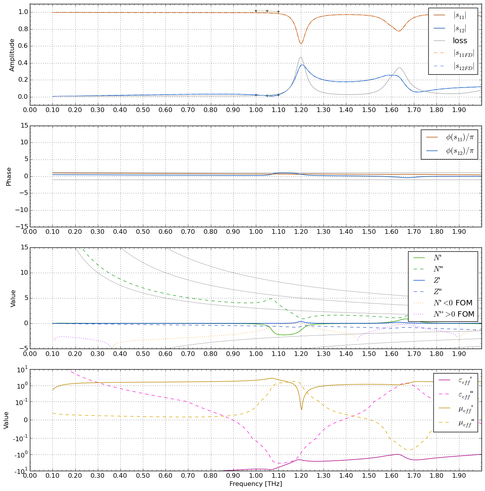

## About this example
MEEP allows to run a FDTD simulation in the time domain, but also has a built-in BiCGStab solver that optimizes the fields shape to match the eigenfunction problem:

L*ψ* = exp(-i*ωt*) *ψ*, 

where L is the Maxwell operator [1], *ψ* is the (vector) field function sought for, and *ω* is the user-defined angular frequency.

Here, the script `scatter.py` is ran multiple times in frequency-domain to compute a simple negative-index metamaterial - a dielectric microsphere embedded in a metallic mesh.  For more information on this structure, see e.g. `metamaterial_models.py` where it is defined.

Finally, its results are computed to the classical Fourier-transformed time-domain simulation and it is shown that they are similar, although the algorithm are fundamentally different.

A big effort was put into the Python scripts to make the switch between FDTD and FDFD simulations as easy as possible: It can be done just by adding the parameter `frequency=...`.

### References
[1] John D Joannopoulos et al. *Photonic crystals: molding the flow of light*. Princeton university press, 2011

## Usage
Run `batch.sh`. Total computation time is about 20 minutes in single process. 

See its short code for inspiration how to use the frequency-domain simulations.

## Expected results
The results are in the form of one big plot with the comparison of FDTD (line) and FDFD (discrete points). Reflection of the structure is `s11`, transmission is `s12`. From the FDTD results, also the effective parameters are computed using the s-parameter method:

Each point is accompanied by the `png/` directory containing the Ex field shapes from the frequency-domain. Following field plots are the results around the first (magnetic Mie-type) resonance for 1000, 1100, 1200 and 1300 GHz, respectively:

More detailed scans of the structure behaviour can be obtained by editing the `batch.sh` script. 

